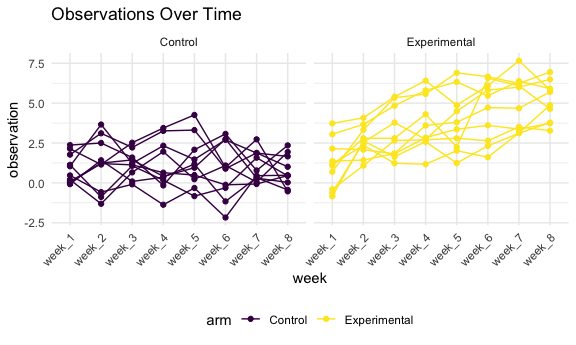

p8105_hw5_co2554
================
Camille Okonkwo

Set seed for reproducibility.

``` r
set.seed(12345)
```

### Problem 2

This zip file contains data from a longitudinal study that included a
control arm and an experimental arm. Data for each participant is
included in a separate file, and file names include the subject ID and
arm.

Create a tidy dataframe containing data from all participants, including
the subject ID, arm, and observations over time:

``` r
long_study_files = list.files(path = "data/", pattern = ".csv", full.names = TRUE)

long_study_df =
  long_study_files |> 
  map_df(~{
    read.csv(.x)  |> 
      janitor::clean_names()  |> 
      mutate(
        subject_id = as.numeric(str_extract(.x, "\\d+")),
        arm = ifelse(grepl("con", .x), "Control", "Experimental")
      )  |> 
      pivot_longer(
        cols = starts_with("week_"),
        names_to = "week", 
        values_to = "observation"
      )  |> 
      select(subject_id, arm, everything())
  })
```

Make a spaghetti plot showing observations on each subject over time.

``` r
long_study_df |>
  ggplot(aes(x = week, y = observation, color = arm, group = subject_id)) +
  geom_line() +
  geom_point() +
  labs(title = "Observations Over Time") +
  facet_wrap(~arm) +
  theme(axis.text.x = element_text(angle = 45, hjust = 1))
```



The plot shows us that the expiremental group has experienced a more
significant increase in the observation values compared to the control
group. The control group values were mostly consistent during the 8 week
period.
