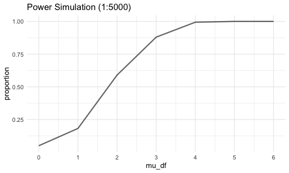
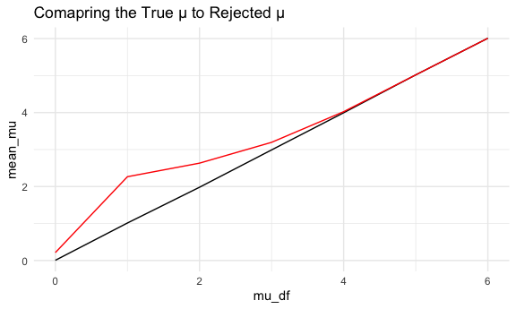

p8105_hw5_co2554
================
Camille Okonkwo

Set seed for reproducibility.

``` r
set.seed(12345)
```

### Problem 2

This zip file contains data from a longitudinal study that included a
control arm and an experimental arm. Data for each participant is
included in a separate file, and file names include the subject ID and
arm.

Create a tidy dataframe containing data from all participants, including
the subject ID, arm, and observations over time:

``` r
long_study_files = list.files(path = "data/", pattern = ".csv", full.names = TRUE)

long_study_df =
  long_study_files |> 
  map_df(~{
    read.csv(.x)  |> 
      janitor::clean_names()  |> 
      mutate(
        subject_id = as.numeric(str_extract(.x, "\\d+")),
        arm = ifelse(grepl("con", .x), "Control", "Experimental")
      )  |> 
      pivot_longer(
        cols = starts_with("week_"),
        names_to = "week", 
        values_to = "observation"
      )  |> 
      select(subject_id, arm, everything())
  })
```

Make a spaghetti plot showing observations on each subject over time.

``` r
long_study_df |>
  ggplot(aes(x = week, y = observation, color = arm, group = subject_id)) +
  geom_line() +
  geom_point() +
  labs(title = "Observations Over Time") +
  facet_wrap(~arm) +
  theme(axis.text.x = element_text(angle = 45, hjust = 1))
```


The plot shows us that the expiremental group has experienced a more
significant increase in the observation values compared to the control
group. The control group values were mostly consistent during the 8 week
period.

### Problem 3

Let’s set up the design elements for our one-sample t-test:

``` r
sim_power = function(mu) {
  
  data = tibble(
    x = rnorm(n = 30, mean = mu, sd = 5)
  )
  
  output = data |> 
    t.test() |> 
    broom::tidy() |> 
    select(estimate, p.value) |> 
    rename(mu_hat = estimate, p_val = p.value)
}

sim_power_results = expand_grid(
  mu_df = c(0, 1, 2, 3, 4, 5, 6), 
  iteration = 1:5000
) |> 
  mutate(
    estimate = map(mu_df, sim_power)
  ) |> 
  unnest(estimate)
```

Now, let’s plot the results of the simulation.

First, we’ll plot the proportion of times the null was rejected (in
other words, the power of the test)

``` r
sim_power_results |> 
  group_by(mu_df) |> 
  summarize(
    reject = sum(p_val < 0.05), 
    proportion = reject / 5000
  ) |> 
  ggplot(aes(x = mu_df, y = proportion)) +
  geom_line(alpha = 0.6, linewidth = 0.9) +
  scale_x_continuous(breaks = seq(0,6, 1)) +
  labs(title = "Power Simulation (1:5000)")
```



It appears that as the effect size increases, power also increases. This
is due to the overlapping between the average of the alternative
distribution with the null distribution, which increases our likelihood
of rejecting the null.

To conclude, I’m going to make a plot that shows the average estimate of
μ̂ on the y axis and the true value of μ on the x axis. To do this, I’ll
first separate the true values of μ̂ from the rejected values of μ̂.

``` r
true_mu =
  sim_power_results |> 
  group_by(mu_df) |> 
  summarize(mean_mu = mean(mu_hat))
```

``` r
reject_mu = 
  sim_power_results |> 
  filter(p_val < 0.05) |> 
  group_by(mu_df) |> 
  summarize(mean_mu = mean(mu_hat))
```

Now, we plot.

``` r
ggplot(true_mu, aes(x = mu_df, y = mean_mu)) +
  geom_line() +
  geom_line(data = reject_mu, color = "red") +
  labs(title = "Comapring the True μ to Rejected μ")
```



The red rejected μ line illustrates the relationship between true μ
values and average μ_hat value of those who were rejected, p_value less
than 0.05, and the black line illustrates the relationship for all
samples within the data set.

We can see the average μ_hat value of the samples where the null was
rejected are different from the true mu value from 0 to 3. The rejected
μ values line begins to mimic true μ values at roughly 4.
