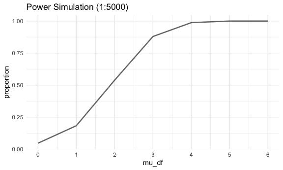

p8105_hw5_co2554
================
Camille Okonkwo

Set seed for reproducibility.

``` r
set.seed(12345)
```

## Problem 1

For this problem, we are interested in data gathered and made public by
*The Washington Post* on homicides in 50 large U.S. cities. The code
chunk below imports and cleans the data.

``` r
homicide_df = 
readr::read_csv("https://raw.githubusercontent.com/washingtonpost/data-homicides/master/homicide-data.csv") |> 
  mutate(
    city_state = str_c(city, state, sep = ", "),
    resolution = case_when(
      disposition == "Closed without arrest" ~ "unsolved",
      disposition == "Open/No arrest"        ~ "unsolved",
      disposition == "Closed by arrest"      ~ "solved"
    )
  )|> 
  filter(city_state != "Tulsa, AL") 
```

    ## Rows: 52179 Columns: 12
    ## ── Column specification ────────────────────────────────────────────────────────
    ## Delimiter: ","
    ## chr (9): uid, victim_last, victim_first, victim_race, victim_age, victim_sex...
    ## dbl (3): reported_date, lat, lon
    ## 
    ## ℹ Use `spec()` to retrieve the full column specification for this data.
    ## ℹ Specify the column types or set `show_col_types = FALSE` to quiet this message.

The resulting dataframe has 52178 entries, on variables that include the
victim name, race, age, and sex; the date the homicide was reported; and
the location of the homicide. In cleaning, I created a `city_state`
variable that includes both city and state, and a `resolution` variable
to indicate whether the case was closed by arrest. I also excluded one
entry in Tulsa, AL, which is not a major US city and is most likely a
data entry error.

In the next code chunk, I group within cities and summarize to produce
the total number of homicides and the number that are solved.

``` r
city_homicide_df = 
  homicide_df |> 
  select(city_state, disposition, resolution) |> 
  group_by(city_state) |> 
  summarize(
    hom_total = n(),
    hom_unsolved = sum(resolution == "unsolved"))
```

Focusing only on Baltimore, MD, I can use the `prop.test` and
`broom::tidy` functions to obtain an estimate and CI of the proportion
of unsolved homicides in that city. The table below shows those values.

``` r
bmore_test = 
  prop.test(
    x = filter(city_homicide_df, city_state == "Baltimore, MD") |> pull(hom_unsolved),
    n = filter(city_homicide_df, city_state == "Baltimore, MD") |>  pull(hom_total)) 

broom::tidy(bmore_test) |> 
  knitr::kable(digits = 3)
```

| estimate | statistic | p.value | parameter | conf.low | conf.high | method                                               | alternative |
|---------:|----------:|--------:|----------:|---------:|----------:|:-----------------------------------------------------|:------------|
|    0.646 |   239.011 |       0 |         1 |    0.628 |     0.663 | 1-sample proportions test with continuity correction | two.sided   |

Building on this code, I can use functions in the `purrr` package to
obtain estimates and CIs for the proportion of unsolved homicides in
each city in my dataset. The code below implements this analysis.

``` r
test_results = 
  city_homicide_df %>% 
  mutate(
    prop_tests = map2(hom_unsolved, hom_total, \(x, y) prop.test(x = x, n = y)),
    tidy_tests = map(prop_tests, broom::tidy)) %>% 
  select(-prop_tests) %>% 
  unnest(tidy_tests) %>% 
  select(city_state, estimate, conf.low, conf.high) %>% 
  mutate(city_state = fct_reorder(city_state, estimate))
```

Finally, I make a plot showing the estimate (and CI) of the proportion
of unsolved homicides in each city.

``` r
test_results %>% 
  mutate(city_state = fct_reorder(city_state, estimate)) %>% 
  ggplot(aes(x = city_state, y = estimate)) + 
  geom_point() + 
  geom_errorbar(aes(ymin = conf.low, ymax = conf.high)) + 
  theme(axis.text.x = element_text(angle = 90, hjust = 1))
```


This figure suggests a very wide range in the rate at which homicides
are solved – Chicago is noticeably high and, given the narrowness of the
CI, likely is the location of many homicides.

### Problem 2

This zip file contains data from a longitudinal study that included a
control arm and an experimental arm. Data for each participant is
included in a separate file, and file names include the subject ID and
arm.

Create a tidy dataframe containing data from all participants, including
the subject ID, arm, and observations over time:

``` r
long_study_files = list.files(path = "data/", pattern = ".csv", full.names = TRUE)

long_study_df =
  long_study_files |> 
  map_df(~{
    read.csv(.x)  |> 
      janitor::clean_names()  |> 
      mutate(
        subject_id = as.numeric(str_extract(.x, "\\d+")),
        arm = ifelse(grepl("con", .x), "Control", "Experimental")
      )  |> 
      pivot_longer(
        cols = starts_with("week_"),
        names_to = "week", 
        values_to = "observation"
      )  |> 
      select(subject_id, arm, everything())
  })
```

Make a spaghetti plot showing observations on each subject over time.

``` r
long_study_df |>
  ggplot(aes(x = week, y = observation, color = arm, group = subject_id)) +
  geom_line() +
  geom_point() +
  labs(title = "Observations Over Time") +
  facet_wrap(~arm) +
  theme(axis.text.x = element_text(angle = 45, hjust = 1))
```


The plot shows us that the expiremental group has experienced a more
significant increase in the observation values compared to the control
group. The control group values were mostly consistent during the 8 week
period.

### Problem 3

Let’s set up the design elements for our one-sample t-test:

``` r
sim_power = function(mu) {
  
  data = tibble(
    x = rnorm(n = 30, mean = mu, sd = 5)
  )
  
  output = data |> 
    t.test() |> 
    broom::tidy() |> 
    select(estimate, p.value) |> 
    rename(mu_hat = estimate, p_val = p.value)
}

sim_power_results = expand_grid(
  mu_df = c(0, 1, 2, 3, 4, 5, 6), 
  iteration = 1:5000
) |> 
  mutate(
    estimate = map(mu_df, sim_power)
  ) |> 
  unnest(estimate)
```

Now, let’s plot the results of the simulation.

First, we’ll plot the proportion of times the null was rejected (in
other words, the power of the test)

``` r
sim_power_results |> 
  group_by(mu_df) |> 
  summarize(
    reject = sum(p_val < 0.05), 
    proportion = reject / 5000
  ) |> 
  ggplot(aes(x = mu_df, y = proportion)) +
  geom_line(alpha = 0.6, linewidth = 0.9) +
  scale_x_continuous(breaks = seq(0,6, 1)) +
  labs(title = "Power Simulation (1:5000)")
```



It appears that as the effect size increases, power also increases. This
is due to the overlapping between the average of the alternative
distribution with the null distribution, which increases our likelihood
of rejecting the null.

To conclude, I’m going to make a plot that shows the average estimate of
μ̂ on the y axis and the true value of μ on the x axis. To do this, I’ll
first separate the true values of μ̂ from the rejected values of μ̂.

``` r
true_mu =
  sim_power_results |> 
  group_by(mu_df) |> 
  summarize(mean_mu = mean(mu_hat))
```

``` r
reject_mu = 
  sim_power_results |> 
  filter(p_val < 0.05) |> 
  group_by(mu_df) |> 
  summarize(mean_mu = mean(mu_hat))
```

Now, we plot.

``` r
ggplot(true_mu, aes(x = mu_df, y = mean_mu)) +
  geom_line() +
  geom_line(data = reject_mu, color = "red") +
  labs(title = "Comapring the True μ to Rejected μ")
```


The red rejected μ line illustrates the relationship between true μ
values and average μ_hat value of those who were rejected, p_value less
than 0.05, and the black line illustrates the relationship for all
samples within the data set.

We can see the average μ_hat value of the samples where the null was
rejected are different from the true mu value from 0 to 3. The rejected
μ values line begins to mimic true μ values at roughly 4.
